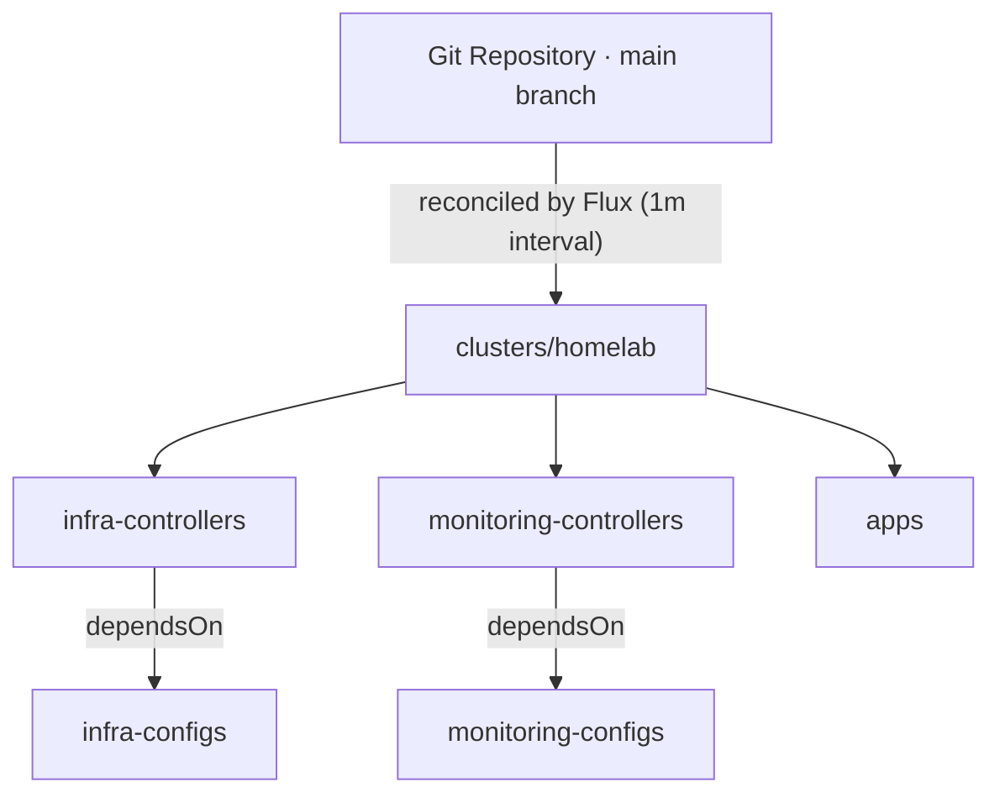

# Homelab

> GitOps configuration and documentation for my self-hosted Kubernetes homelab.

[](https://github.com/matt-maxwell/homelab/actions/workflows/test.yaml)
[](https://fluxcd.io/)
[](https://kubernetes.io/)
[](https://docs.renovatebot.com/)

This repository is the single source of truth for my Kubernetes homelab. Everything that runs in the cluster - controllers, storage, ingress, monitoring, and applications - is defined here as declarative manifests and reconciled automatically by [Flux](https://fluxcd.io/). There is no `kubectl apply` by hand: a change is made by opening a pull request, and once it merges to `main` the cluster converges to match.

## Table of Contents

- [Overview](#overview)
- [How It Works](#how-it-works)
- [Stack](#stack)
- [Repository Structure](#repository-structure)
- [Secrets Management](#secrets-management)
- [Networking & TLS](#networking--tls)
- [Observability](#observability)
- [Automation](#automation)
- [Getting Started](#getting-started)
- [Local Validation](#local-validation)
- [Adding a New Application](#adding-a-new-application)
- [Acknowledgements](#acknowledgements)

## Overview

The core idea is **GitOps**: the desired state of the cluster lives in Git, and an in-cluster agent continuously reconciles the live state toward it.



Flux watches this repository and applies the manifests under [`clusters/homelab`](clusters/homelab). Those in turn point at three logical layers - **infrastructure**, **monitoring**, and **apps** - each of which is split into a reusable `base` and a cluster-specific `homelab` overlay using [Kustomize](https://kustomize.io/).

## How It Works

Flux is bootstrapped so that the `flux-system` Kustomization reconciles the [`clusters/homelab`](clusters/homelab) directory every 10 minutes, while the Git source is polled every minute. That directory defines the top-level Kustomizations that build the rest of the cluster:

| Kustomization | Path | Notes |
| --- | --- | --- |
| `infra-controllers` | `infrastructure/controllers/homelab` | Deploys core controllers. Runs with `wait: true` so dependents block until it is healthy. |
| `infra-configs` | `infrastructure/configs/homelab` | Cluster-scoped config (issuers, secret stores, ingresses). `dependsOn` `infra-controllers`. |
| `monitoring-controllers` | `monitoring/controllers/homelab` | Deploys the observability stack. |
| `monitoring-configs` | `monitoring/configs/homelab` | Dashboards/ingress for monitoring. `dependsOn` `monitoring-controllers`. |
| `apps` | `apps/homelab` | End-user applications. |

`dependsOn` and `wait: true` enforce ordering - for example, the config layer that creates a `ClusterIssuer` will not run until cert-manager's CRDs and controller are actually up, which avoids the classic "CRD not found" race on a fresh cluster.

### The base / overlay pattern

Every component follows the same convention:

- **`base/`** - the reusable, environment-agnostic manifests (a `HelmRelease`, `HelmRepository`, `Namespace`, etc.).
- **`homelab/`** - a thin overlay that references the base and layers on any cluster-specific tweaks or patches.

This keeps environment-specific values out of the base definitions and makes it straightforward to add a second cluster later without duplicating everything.

## Stack

Components are deployed via Flux `HelmRelease` resources (or plain manifests), with versions pinned in the manifests and kept current by [Renovate](#automation). Check the relevant `release.yaml` for the exact version running.

### Platform

| Tool | Role |
| --- | --- |
| [Flux](https://fluxcd.io/) | GitOps reconciliation engine |
| [Kustomize](https://kustomize.io/) | Manifest composition (base + overlays) |

### Infrastructure

| Component | Role |
| --- | --- |
| [cert-manager](https://cert-manager.io/) | Automated TLS certificates (Let's Encrypt via Cloudflare DNS-01) |
| [Traefik](https://traefik.io/) | Ingress controller / reverse proxy, with automatic HTTP→HTTPS redirect |
| [External Secrets Operator](https://external-secrets.io/) | Syncs Kubernetes Secrets from an external vault |
| [Longhorn](https://longhorn.io/) | Distributed block storage / default StorageClass |
| [metrics-server](https://github.com/kubernetes-sigs/metrics-server) | Resource metrics for `kubectl top` and autoscaling |
| [Trivy Operator](https://aquasecurity.github.io/trivy-operator/) | Continuous vulnerability and misconfiguration scanning |
| [Renovate](https://docs.renovatebot.com/) | Automated dependency updates (in-cluster hourly `CronJob`) |

### Monitoring

| Component | Role |
| --- | --- |
| [kube-prometheus-stack](https://github.com/prometheus-community/helm-charts) | Prometheus + Grafana (Alertmanager disabled) |
| [Loki](https://grafana.com/oss/loki/) | Log aggregation (single-binary, filesystem backend) |
| [Promtail](https://grafana.com/docs/loki/latest/send-data/promtail/) | Ships node/pod logs to Loki |

### Applications

| Component | Role |
| --- | --- |
| [Homepage](https://gethomepage.dev/) | Dashboard that auto-discovers services and surfaces widgets (Pi-hole, Plex, Grafana, Longhorn) |

## Repository Structure

```
.
├── apps/                      # End-user applications
│   ├── base/                  #   Reusable app manifests (homepage, test-app)
│   └── homelab/               #   Cluster overlay
├── clusters/
│   └── homelab/               # Flux entrypoint for the cluster
│       ├── flux-system/       #   Flux components + Git sync (managed by `flux bootstrap`)
│       ├── apps.yaml          #   → apps/homelab
│       ├── infrastructure.yaml#   → infrastructure/controllers + configs
│       └── monitoring.yaml    #   → monitoring/controllers + configs
├── infrastructure/
│   ├── controllers/           # cert-manager, traefik, external-secrets,
│   │   ├── base/              #   longhorn, metrics-server, trivy, renovate
│   │   └── homelab/
│   └── configs/               # ClusterIssuers, ClusterSecretStore, ingresses
│       ├── base/
│       └── homelab/
├── monitoring/
│   ├── controllers/           # kube-prometheus-stack, loki, promtail
│   └── configs/               # Ingress routes for Grafana/Prometheus
├── scripts/
│   └── validate.sh            # Local + CI manifest validation
├── .github/workflows/
│   └── test.yaml              # CI: validates manifests on every push/PR
└── renovate.json              # Renovate configuration
```

## Secrets Management

No secrets are committed to this repository. Instead, the [External Secrets Operator](https://external-secrets.io/) is configured with a `ClusterSecretStore` backed by **Azure Key Vault** (authenticated with a Service Principal). Individual `ExternalSecret` resources declare which keys to pull, and the operator materialises them as native Kubernetes `Secret` objects and keeps them refreshed.

For example, the Homepage dashboard's API keys (Pi-hole, Plex, Grafana credentials) are declared as an `ExternalSecret` that syncs from the vault on a one-hour interval - so rotating a value in Key Vault propagates into the cluster with no repository change.

The two credentials that must exist for the cluster to fully reconcile are:

- **`cloudflare-api-token`** - used by cert-manager to solve DNS-01 challenges.
- **`azure-kv-credentials`** - the Service Principal used by External Secrets to reach the vault.

## Networking & TLS

- **Ingress** is handled by **Traefik**, which terminates traffic and redirects all HTTP to HTTPS.
- **Certificates** are issued automatically by **cert-manager** using a Let's Encrypt `ClusterIssuer` with the Cloudflare **DNS-01** solver, so services get valid TLS without exposing an HTTP challenge endpoint.
- Services are exposed under a wildcard-style internal domain (`*.k8s.local.<your-domain>`); each `Ingress` requests its own certificate via a `cert-manager.io/cluster-issuer` annotation.
- Ingresses are additionally annotated for **Homepage** auto-discovery (`gethomepage.dev/*`), so new services show up on the dashboard automatically once deployed.

## Observability

The monitoring stack provides metrics and logs out of the box:

- **Prometheus** scrapes cluster components - including etcd, kube-scheduler, and kube-controller-manager - and any `ServiceMonitor`/`PodMonitor` in the cluster.
- **Grafana** is the visualization layer, with dashboards persisted to a Longhorn-backed PVC and admin credentials sourced from the secret store.
- **Loki + Promtail** provide centralized log aggregation, with Promtail running as a DaemonSet shipping logs to Loki.

> Alertmanager is currently disabled, and Loki uses a filesystem backend (single-binary mode) - appropriate for a homelab, but not intended for long-term log retention.

## Automation

- **CI validation** - the [`test`](.github/workflows/test.yaml) GitHub Actions workflow runs on every push and pull request. It uses `kustomize build` piped into [`kubeconform`](https://github.com/yannh/kubeconform) (with the Flux CRD schemas) to catch invalid or broken manifests *before* they reach the cluster.
- **Dependency updates** - [Renovate](https://docs.renovatebot.com/) watches Helm charts, container images, and Kubernetes/Flux resources. It opens PRs for new versions and maintains a Dependency Dashboard. Renovate runs both as a hosted app (see [`renovate.json`](renovate.json)) and as an in-cluster hourly `CronJob`.
- **Security scanning** - the Trivy Operator continuously scans running workloads for known vulnerabilities.

## Local Validation

The same checks CI can be ran before pushing. This downloads the Flux OpenAPI schemas and validates every manifest and Kustomize overlay:

```bash
./scripts/validate.sh
```

**Requirements:** `yq` (v4.34+), `kustomize` (v5.3+), and `kubeconform` (v0.6+).

## Adding a New Application

1. Create the app's manifests under `apps/base/<app-name>/` with a `kustomization.yaml`.
2. Add a thin overlay at `apps/homelab/<app-name>/` that references the base.
3. Reference the new overlay in `apps/homelab/kustomization.yaml`.
4. Annotate the `Ingress` with `gethomepage.dev/*` labels so it appears on the dashboard.
5. Open a PR - CI validates it, and merging to `main` deploys it.

## Acknowledgements

The layout and validation tooling follow patterns from the [Flux documentation](https://fluxcd.io/flux/) and the broader homelab / GitOps community (e.g. [k8s-at-home](https://github.com/k8s-at-home) and the [`fluxcd/flux2-kustomize-helm-example`](https://github.com/fluxcd/flux2-kustomize-helm-example) reference repository).